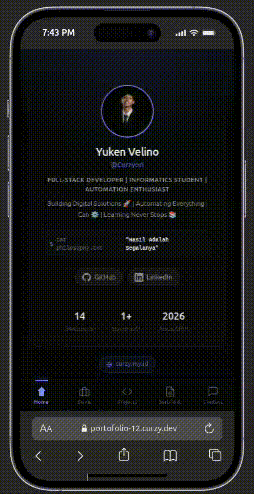

<h1 align="center">Curzy</h1>
<p align="center">
  <strong>Premium Mobile Link Hub & Portfolio</strong>
</p>

<p align="center">
  <a href="https://portofolio-12.curzy.dev/"><strong>🌐 Live Demo</strong></a>
</p>

<div align="center">

[](https://github.com/Curzyori/portofolio-template/stargazers)
[](https://github.com/Curzyori/portofolio-template/network/members)
[](LICENSE)
[](#)

</div>

<p align="center">
  <a href="#-why-curzy">Why This</a> ·
  <a href="#-key-features">Features</a> ·
  <a href="#-tech-stack">Tech Stack</a> ·
  <a href="#-quick-start">Quick Start</a>
</p>

---

## 🕒 Why Curzy?

Curzy is a premium mobile-first link hub and portfolio template for developers with a **Terminal Glass** aesthetic — inspired by products like Raycast, Linear, and Apple.

### The Problem

Free link hub services like Linktree often have limited features and lack the distinctive character developers want. On the other hand, building a full-stack portfolio from scratch requires database maintenance, complex API setup, and monthly server costs.

### The Solution

Curzy solves this: a premium mobile-first link hub that is **100% static with no backend or API required**.

- Extremely lightweight, instant page loads
- Zero maintenance cost
- Highly interactive experience like a native mobile app

---

## 🎯 Key Features

| Feature | Status | Description |
| :--- | :---: | :--- |
| **100% Mobile-First** | ✅ | Optimized for 70%+ visitors on mobile devices |
| **Terminal Glass UI** | ✅ | Premium dark theme inspired by Raycast, Linear, Apple |
| **5-Tabs Navigation** | ✅ | Home, Bisnis, Projects, Sertifikat, Contact |
| **Dynamic Content Filter** | ✅ | "All vs Fav" filter on Projects tab |
| **Consistency Index** | ✅ | Project numbers stay locked during filtering |
| **Graceful Empty State** | ✅ | Clean feedback for empty categories |
| **SEO & Accessibility** | ✅ | Static prerender, semantic HTML, complete meta tags |

---

## 🛠️ Tech Stack

| Technology | Why |
| :--------- | :-- |
| **Next.js (App Router)** | Static content prerender, < 1s load time, max SEO |
| **Tailwind CSS** | Efficient Terminal Glass theme implementation |
| **TypeScript** | Type-safe links, projects, and certificates data |

---

## 🚀 Quick Start

### Prerequisites
Make sure you have Node.js (v18+) and npm installed.

### Clone & Install

```bash
git clone https://github.com/Curzyori/portofolio-template.git
cd portofolio-template
npm install
```

### Run Development Server

```bash
npm run dev
```

Open [http://localhost:3000](http://localhost:3000) in your browser.

### Customizing Data

You **do not need to modify UI code**. Simply edit:

```
data/links.ts
```

Update the object properties with your own information — Next.js will refresh automatically.

---

## 🖼️ Preview

<table align="center">
  <tr>
    <td align="center"><b>Web App Preview</b></td>
  </tr>
  <tr>
    <td></td>
  </tr>
</table>

---

## 📄 License

This project is released under the **MIT License** — fully open source, free to use for personal and commercial purposes, see [LICENSE](LICENSE) for full text.

---

## 🔗 Connect

<p align="center">
  <a href="https://github.com/Curzyori">
    
  </a>
  <a href="https://curzy.dev">
    
  </a>
  <a href="https://linkedin.com/in/curzy">
    
  </a>
</p>

<sub>Built with passion as the 12th Project of the <strong>50 Projects Challenge</strong> by <strong>@curzyori</strong></sub>
